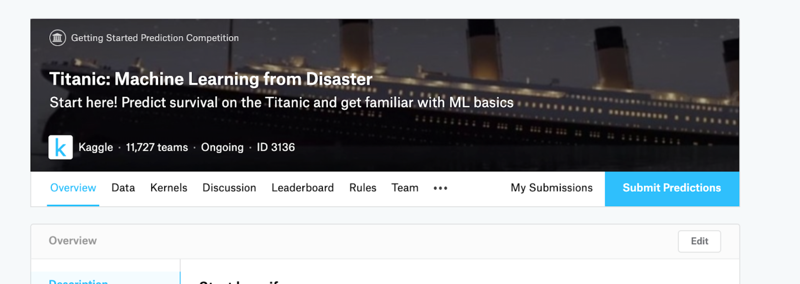
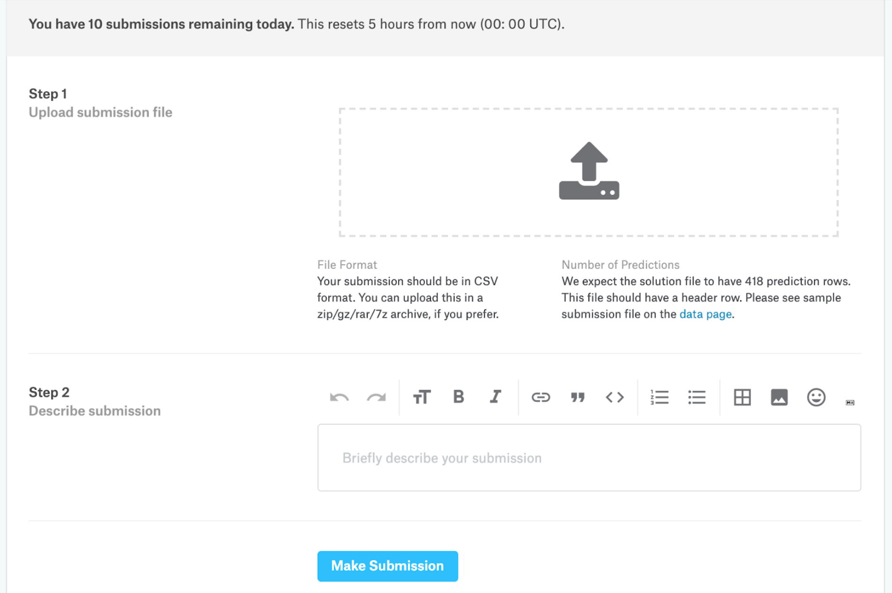

# Kaggle-Competition-Titanic---Machine-Learning-from-Disaster

**Project Title:** Titanic - Machine Learning from Disaster

**Source:** https://www.kaggle.com/competitions/titanic/overview/description

<h4>Brief Description:</h4>

Building a predictive model that answers the question: “what sorts of people were more likely to survive the sinking of the Titanic?". The end result should be a model built off of passenger data (ie name, age, gender, socio-economic class, etc).Building a predictive model that answers the question: “what sorts of people were more likely to survive the sinking of the Titanic?". The end result should be a model built off of passenger data (ie name, age, gender, socio-economic class, etc).

<br>

# Full Description:
👋🛳️ Ahoy, welcome to Kaggle! You’re in the right place.
This is the legendary Titanic ML competition – the best, first challenge for you to dive into ML competitions and familiarize yourself with how the Kaggle platform works.

The competition is simple: use machine learning to create a model that predicts which passengers survived the Titanic shipwreck.

Read on or watch the video below to explore more details. Once you’re ready to start competing, click on the "[Join Competition](https://www.kaggle.com/account/login?returnUrl=%2Fc%2Ftitanic)" button to create an account and gain access to the [competition data](https://www.kaggle.com/c/titanic/data). Then check out [Alexis Cook’s Titanic Tutorial](https://www.kaggle.com/alexisbcook/titanic-tutorial) that walks you through step by step how to make your first submission!


[](https://www.youtube.com/watch?v=8yZMXCaFshs)
<br>

**The Challenge**

The sinking of the Titanic is one of the most infamous shipwrecks in history.

On April 15, 1912, during her maiden voyage, the widely considered “unsinkable” RMS Titanic sank after colliding with an iceberg. Unfortunately, there weren’t enough lifeboats for everyone onboard, resulting in the death of 1502 out of 2224 passengers and crew.

While there was some element of luck involved in surviving, it seems some groups of people were more likely to survive than others.

In this challenge, we ask you to build a predictive model that answers the question: “what sorts of people were more likely to survive?” using passenger data (ie name, age, gender, socio-economic class, etc).

<br>

**Overview of How Kaggle’s Competitions Work**

1. Join the Competition: Read about the challenge description, accept the Competition Rules and gain access to the competition dataset.

2. Get to Work: Download the data, build models on it locally or on Kaggle Notebooks (our no-setup, customizable Jupyter Notebooks environment with free GPUs) and generate a prediction file.

3. Make a Submission: Upload your prediction as a submission on Kaggle and receive an accuracy score.

4. Check the Leaderboard: See how your model ranks against other Kagglers on our leaderboard.

5. Improve Your Score: Check out the discussion forum to find lots of tutorials and insights from other competitors.

<br>

**What Data Will I Use in This Competition?**

In this competition, you’ll gain access to two similar datasets that include passenger information like name, age, gender, socio-economic class, etc. One dataset is titled `train.csv` and the other is titled `test.csv`.

Train.csv will contain the details of a subset of the passengers on board (891 to be exact) and importantly, will reveal whether they survived or not, also known as the “ground truth”.

The `test.csv` dataset contains similar information but does not disclose the “ground truth” for each passenger. It’s your job to predict these outcomes.

Using the patterns you find in the train.csv data, predict whether the other 418 passengers on board (found in test.csv) survived.

Check out the “Data” tab to explore the datasets even further. Once you feel you’ve created a competitive model, submit it to Kaggle to see where your model stands on our leaderboard against other Kagglers.

<br>

**How to Submit your Prediction to Kaggle**

Once you’re ready to make a submission and get on the leaderboard:

1. Click on the “Submit Predictions” button


2. Upload a CSV file in the submission file format. You’re able to submit 10 submissions a day.


<br>

**Submission File Format:**

You should submit a csv file with exactly 418 entries plus a header row. Your submission will show an error if you have extra columns (beyond PassengerId and Survived) or rows.

The file should have exactly 2 columns:
<ul>
  <li>PassengerId (sorted in any order)</li>
  <li>Survived (contains your binary predictions: 1 for survived, 0 for deceased)</li>
</ul>

<br>

**Got it! I’m ready to get started. Where do I get help if I need it?**

For Competition Help: [Titanic Discussion Forum](https://www.kaggle.com/c/titanic/discussion)
Technical Help: [Kaggle Contact Us Page](https://www.kaggle.com/contact)

Kaggle doesn’t have a dedicated support team so you’ll typically find that you receive a response more quickly by asking your question in the appropriate forum. The forums are full of useful information on the data, metric, and different approaches. We encourage you to use the forums often. If you share your knowledge, you'll find that others will share a lot in turn!

<br>

**A Last Word on Kaggle Notebooks**
As we mentioned before, Kaggle Notebooks is our no-setup, customizable, Jupyter Notebooks environment with free GPUs and a huge repository of community published data & code.

In every competition, you’ll find many Notebooks shared with incredible insights. It’s an invaluable resource worth becoming familiar with. Check out this competition’s Notebooks [here](https://www.kaggle.com/c/titanic/notebooks).

<br>


**🏃‍♀Ready to Compete? [Join the Competition Here!](https://www.kaggle.com/account/login?returnUrl=%2Fc%2Ftitanic)**


<br>

# Evaluation

**Goal**

It is your job to predict if a passenger survived the sinking of the Titanic or not.
For each in the test set, you must predict a 0 or 1 value for the variable.

<br>

**Metric**

Your score is the percentage of passengers you correctly predict. This is known as [accuracy](https://en.wikipedia.org/wiki/Accuracy_and_precision#In_binary_classification).

<br>

**Submission File Format**

You should submit a csv file with exactly 418 entries plus a header row. Your submission will show an error if you have extra columns (beyond PassengerId and Survived) or rows.
The file should have exactly 2 columns:
<ul>
  <li>PassengerId (sorted in any order)</li>
  <li>Survived (contains your binary predictions: 1 for survived, 0 for deceased)</li>
</ul>

<br>

```
PassengerId,Survived
892,0
893,1
894,0
Etc.
```

<br>

You can download an example submission file (gender_submission.csv) on the [Data page](https://www.kaggle.com/c/titanic/data).

<br>

# FAQ (Frequently Asked Questions)

**What is a Getting Started competition?**

Getting Started competitions were created by Kaggle data scientists for people who have little to no machine learning background. They are a great place to begin if you are new to data science or just finished a MOOC and want to get involved in Kaggle.

Getting Started competitions are a non-competitive way to get familiar with Kaggle’s platform, learn basic machine learning concepts, and start meeting people in the community. They have no cash prize and are on a rolling timeline.

<br>

**How do I create and manage a team?**

When you accept the competition rules, a team will be created for you. You can invite others to your team, accept a merger with another team, and update basic information like team name by going to the More > [Team](https://www.kaggle.com/c/titanic/team) page.

We've heard from many Kagglers that teaming up is the best way to learn new skills AND have fun. If you don't have a teammate already, consider asking if anyone wants to team up in the [discussion](https://www.kaggle.com/c/titanic/discussion) forum.

<br>

**What are Notebooks?**

Kaggle Notebooks is a cloud computational environment that enables reproducible and collaborative analysis. Notebooks support scripts in Python and R, Jupyter Notebooks, and RMarkdown reports. You can visit the [Notebooks](https://www.kaggle.com/c/titanic/notebooks) tab to view all of the publicly shared code for the Titanic competition. For more on how to use Notebooks to learn data science, check out our [Courses!](https://www.kaggle.com/learn/overview)

<br>

**Why did my team disappear from the leaderboard?**

To keep with the spirit of getting-started competitions, we have implemented a two month rolling window on submissions. Once a submission is more than two months old, it will be invalidated and no longer count towards the leaderboard.

If your team has no submissions in the previous two months, the team will also drop from the leaderboard. This will keep the leaderboard at a manageable size, freshen it up, and prevent newcomers from getting lost in a sea of abandoned scores.

"I worked so hard to get that score! Give it back!" Read more about our decision to implement a rolling leaderboard [here](https://www.kaggle.com/c/titanic/discussion/6240).

<br>

**How do I contact Support?**

Kaggle does not have a dedicated support team so you’ll typically find that you receive a response more quickly by asking your question in the appropriate forum. (For this competition, you’ll want to use the [Titanic discussion forum](https://www.kaggle.com/c/titanic/discussion)).

Support is only able to help with issues that are being experienced by all participants. Before contacting support, please check the discussion forum for information on your problem. If you can’t find it, you can post your problem in the forum so a fellow participant or a Kaggle team member can provide help. The forums are full of useful information on the data, metric, and different approaches. We encourage you to use the forums often. If you share your knowledge, you'll find that others will share a lot in turn!

If your problem persists or it seems to be effective all participants then please [contact us](https://www.kaggle.com/contact).


